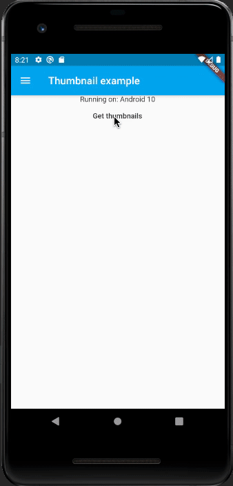
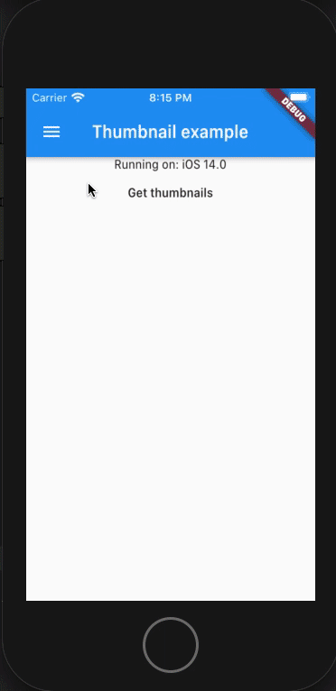

# Flutter Media Streamer
  
A Flutter plugin for streaming Media on iOS and Android

## Example Screenshots
  
  
## Getting Started  
  
Add Flutter Media Streamer to your project's dependencies:
```yaml
dependencies:
  flutter_media_streamer: ^1.0.2
```
On iOS add usage description for the Gallery inside your `Runner/Info.plist` file:
```xml
<key>NSPhotoLibraryUsageDescription</key>
<string>This app shows photos from your photo library.</string>
```

On Android add `READ_EXTERNAL_STORAGE` permission to Manifest:
```xml
<uses-permission android:name="android.permission.READ_EXTERNAL_STORAGE"/>
```
 
## Qureying for images metadata
 
### Get the last 100 images added to the gallery using the Abstraction Layer
```dart
final res = await FlutterMediaStreamer.instance  
  .streamImageMetadata()
  .take(100)
  .toList();
```
The abstraction layer is used by `streamImageMetadata` and produces objects
containing data common to both Android's MediaStore Columns and iOS PHAsset.
 
The entire query is wrapped as a Broadcast Stream so that no further actions are needed once you subscribe to the stream.
The stream can be manipulated as you wish (for example `.take(X)` ).

### Get Images with Android specifically in mind:

```dart
final res = await FlutterMediaStreamer.instance  
  .androidImagesMetadata(
	  limit: 10,
	  mediaColumns: [AndroidMediaColumn.duration, AndroidMediaColumn.title]
  )
  .toList();
```
The `limit` argument controls the batch size in which data is transferred between the platform and the Dart code.
The `baseColumns`, `mediaColumns`, `imageColumns` control which Android MediaStore information is delivered back through the stream.

### Get Images with iOS specifically in mind:
```dart
final res = await FlutterMediaStreamer.instance  
  .iOSImagesMetadata()
  .toList();
```
Will return a Stream with all available metadata exposed through iOS PHAsset API.

## Retreiving Image Bytes

### Getting Thumbnails
#### Using Abstraction Layer
```dart
final res = await FlutterMediaStreamer.instance  
  .streamImageMetadata().toList();
    
for (var item in res) {
  final Uint8List imageBytes = await FlutterMediaStreamer.instance  
  .getThumbnail(item.mediaQueryIdentifier);
    // Do something with the data, such as display in Flutter Image.memory()
  }
```

#### Using iOS Model
```dart
final res = await FlutterMediaStreamer.instance  
  .iOSImagesMetadata().toList();
    
for (var item in res) {
  final Uint8List imageBytes = await FlutterMediaStreamer.instance  
  .getThumbnail(item.localIdentifier);
  }
```
#### Using Android Model
```dart
final res = await FlutterMediaStreamer.instance  
  .androidImagesMetadata().toList();
    
for (var item in res) {
  final Uint8List imageBytes = await FlutterMediaStreamer.instance  
  .getThumbnail(item.contentUri);
  }
```
### Getting Images

#### Getting image in original size
```dart
final res = await FlutterMediaStreamer.instance  
  .streamImageMetadata().toList();
    
for (var item in res) {
  final Uint8List imageBytes = await FlutterMediaStreamer.instance  
  .getImage(item.mediaQueryIdentifier);
  }
```
#### Getting a scaled image
```dart
final res = await FlutterMediaStreamer.instance  
  .streamImageMetadata().toList();
    
for (var item in res) {
  final Uint8List imageBytes = await FlutterMediaStreamer.instance  
  .getImage(item.mediaQueryIdentifier, height: 400, width:640);
  }
```
Use the `height` and `width` arguments to specify the desired size.
A value of -1 indicates the original size.

On iOS images will maintain aspect ratio and on Android they will be resized to the given dimentions. This will be fixed to allow customization in later version.
